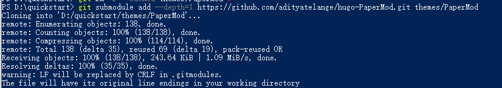

+++
title = 'Windows中使用hugo和Github Pages搭建个人博客（三）'
date = 2024-04-17T16:51:26+08:00
draft = true

+++

[TOC]

> 本篇的主要目的：1. 修改博客的主题，调整字体等
>
> 2. 建立自动化脚本，合并多条命令为一条命令。
> 3. 更换设备之后，如果快速给博客增添新的文章。

# 1.修改博客主题，调整字体

本文选取[hugo-PaperMod](https://themes.gohugo.io/themes/hugo-papermod/)作为主题，当然你可以从[hugo-themes](https://themes.gohugo.io/)选取其他主题进行使用。

1. 打开Powershell，进入到博客所在目录下。（以D:/quickstart目录为例）
2. 使用`git submodule`方式安装PaperMod主题。

```shell
git submodule add --depth=1 https://github.com/adityatelange/hugo-PaperMod.git themes/PaperMod
```



3. 修改hugo.toml文件

